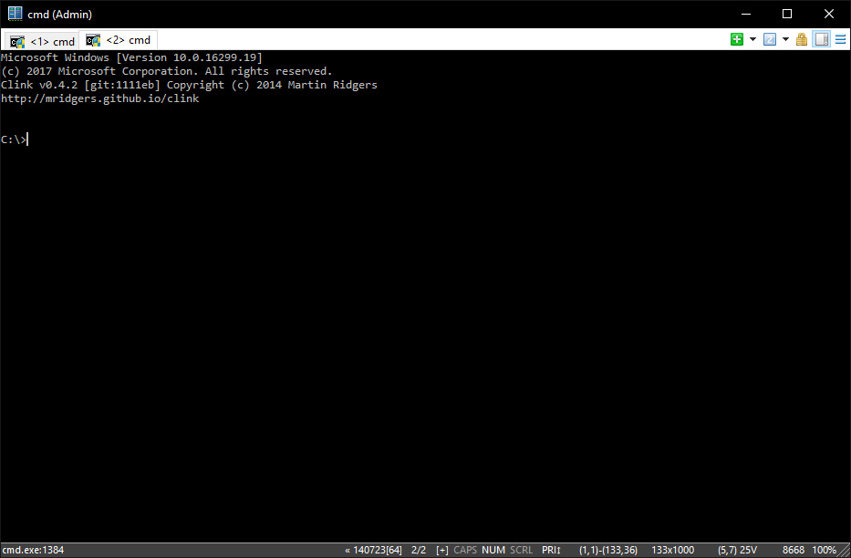

This list is a constantly updated Windows toollist inspired by [nikitavoloboev](https://github.com/nikitavoloboev/my-mac-os/) and [Awesome-Windows](https://github.com/Awesome-Windows/Awesome).
This is by no means a complete workflow list, I tried to list apps here that have an easily understandable value and might not be widely known (except for programs that have recommendable extensions/customization that warrants them to list here anyway)

This list exists partly to give ideas and inspiration (if it gives only a few ideas to a couple of visitors, it was already worth compiling) and also as a shout out to all the great devs who make life better through their creations.

# Development (front-end/web)

### [IntelliJ IDEA/Webstorm](https://www.jetbrains.com/webstorm/)
<table>
  <tr>
    <td width="300"></td>
    <td>
        My main development driver. It's a true IDE with excellent support/plugin for all major languages. The UI is best in class, it has a superb GIT interface, the fastest project search/indexing I've ever seen, and great code intelligence with plugin support for major frameworks too.  
        
        <em><small>This is the first non-free app, and also the costliest - $149 for first year, but this goes down significantly to $119 for second, and $89 from third year onwards. That's $12/7 pro month for the software that - as a developer - saves your ass constantly. Nuff' said. While this is more than worth already, for only web development Webstorm is even cheaper at $129-77/year.</small></em>
    </td>
  </tr>
</table>

### [VS Code](https://code.visualstudio.com/)
<table>
  <tr>
    <td width="300"></td>
    <td>
    My "second main" development tool. By now it has most of the bells and whistles of a mature IDE and it starts to have the speed too (which was holding me back until now). The theme and interface is easily configured and matched to other editors (note that even that hateful smiley can also be removed :v). 
    Along with the various language support and linting extensions, I recommend Git Lens, Color Picker, Path Intellisense, Auto Rename tag and Word Counter.
    </td>
  </tr>
</table>

### [Sublime](https://www.sublimetext.com/)
A great editor in itself, nowadays I mostly use and recommend it for txt/cfg editing and general notepad replacement - because of its lightning-fast speed (VSCode/Atom is not fast enough, other native apps like Notepad++ don't have the features/customizability). I recommend the BracketHighlighter, ColorHighlighter, FileBrowser, SublimeOnSaveBuild packages.
  
<em><small>Although it's not free, it is evaluated free with a minor nag. To remove that, license is a one-time 58€.</small></em>

### [Emmet](https://emmet.io/)
Not a standalone app but a plugin (available in every major code/text editor/language), but it's so ubiquitous in my daily work that it deserves a mention. It basically allows to expand code snippets with the tab key. Eg. in html div.yellow>a< tab > becomes < div class="yellow" >< a href="" >< /a >< /div >, li or < tab > becomes height: in a css file. Needless to say, it speeds things up greatly - it supports custom snippets as well.

### [Insomnia](https://insomnia.rest/)
<table>
  <tr>
    <td width="300"></td>
    <td>
        A great and polished API testing environment. It is similar to Postman - which has some more features like Collection runner and Environments - but I like Insomnia's clean-cutted interface better.
     </td>
 </table>

### [Conemu](https://conemu.github.io/)
<table>
  <tr>
    <td width="300"></td>
    <td>
    The best terminal app on Windows, hands down. Multiple, splittable tabs and smooth window resizing.
    </td>
  </tr>
</table>

### [anywhere](https://www.npmjs.com/package/anywhere)
Not an app but a node utility, this spawns a static file server anywhere. Handy to locally open front-end test projects.

### [Inkscape](https://inkscape.org/en/)
Most devs tend to use full-on suites like Illustrator to edit SVG/vector data, but for most tasks, Inkscape is more than capable for that. Especially the node editing interface rivals that of larger suites.

### [ManicTime](https://www.manictime.com/)
<table>
  <tr>
    <td width="300"></td>
    <td>
    Tracking time on work is absolutely important. I use Manic Time for this - it can capture a wast range of data, has easy to comprehend graphs and statistics, and auto data export for automation.
    </td>
  </tr>
</table>

### [F.lux](https://justgetflux.com/)
Not strictly a dev app, but staring at the screen for days this helps a lot, by shifting the screen to red with sun. Although this was recently implemented natively by macOS/Windows F.lux has adjustable colour profiles, whitelist scenarios and shortcuts.

### [SVG explorer extension](https://svgextension.codeplex.com/)
Websites and apps use SVGs almost as abundantly as any other bitmap images nowadays, but handling them is not as straightforward. For example, you can preview and browse through a pile of images easily, but scanning through SVGs was a lot harder. Until this extension - it enables bitmap-like thumbnail preview in any Windows explorer app.

# Utilities

### [Rambox](http://rambox.pro/)
<table>
  <tr>
    <td width="300"></td>
    <td>
    An awesome electron app aimed at (mostly) web chat services, a method that was pioneered by Franz app. This, while being completely OS, makes connecting to multiple teams and social accounts absolute breeze: it has great OS compatibility (with native and service-supplied notifications) and it's also really fast.
    </td>
  </tr>
</table>

### [Directory Opus](https://www.gpsoft.com.au/)
<table>
  <tr>
    <td width="300"></td>
    <td>
    My absolute favourite file explorer. While some like Commander-style two-pane file lists more, I prefer the faster file tree jumping. It has an absolutely astonishing amount of customization, letting you 100% customize the interface with buttons, toolbars and status texts, along with different file preview. At $58 it's not cheap, but file managers are the most used os utilities one can have.
    </td>
  </tr>
</table>

### [SyncBackPro](https://www.2brightsparks.com/syncback/sbpro.html)
An absolute must-have backup tool for anyone wanting to protect his data. While Windows and seemingly every disk company ships own backup solutions, this one is way better. You can channel different sources in backup profiles and schedule it with Task Scheduler. Besides local backup it supports network/ftp/cloud providers, an awesome UI that lets you fine tune your target/destination as needed, and a lot more.
 
<em><small>Price is $20-$55 but it's needless to say that having a safe mind about your data is paramount.</small></em>

### [7-Zip](http://www.7-zip.org/)
An archive manager that is far beyond the native zip handler and other (mostly shareware) utilities. It's really fast, and has customizeable right click menu options.

### [MonitorSwitcher](https://sourceforge.net/projects/monitorswitcher/)
A must-have utility for anyone working with multiple displays. This command-line tool (gui supplied) can save and load monitor configurations - so switching from display to projector/TV, or between dual/single screen is just a keypress away.

### [Process Explorer](https://docs.microsoft.com/en-us/sysinternals/downloads/process-explorer)
A great replacement to the native task manager (ctrl-shift-esc). It doesn't require admin rights, has a handy process/window finder, and a number of other enhancements.

### [Launchy](https://www.launchy.net/) / [Keypirinha](http://keypirinha.com/)
Task launchers are a bit off since Windows has a similar feature in the Start menu, but having a more powerful/configurable option can greatly enhance your workflow. Launchy is an older, and rather simplistic app, while Keypirinha is an all-rounder with advanced scripting and web-enhanced capabilities.

### [Atomic Alarm Clock](http://www.drive-software.com/atomicalarmclock.html)
A slick windows clock that displays themed, customizeable time/date instead of the fugly default tray clock.

### [Autohotkey](https://autohotkey.com/)
A wonderful scripting tool and platform, which I mostly use to automate tasks. It can perform timed operations, monitor and manipulate windows/processes, emulate keystrokes or mouse clicks, it can even generate native Windows UI itself. A quick script-to-standalone exe compiler is supplied for portability. The platform is powerful enough that full apps and utilities are built upon it.

### [Lockhunter](https://lockhunter.com/)
Surely everyone had the issue when a file or folder couldn't be deleted because some other process still locked it. Lockhunter provides a right-click menu to easily unlock, and also move/rename/delete such files quickly.

### [Rainlendar](http://www.rainlendar.net/cms/index.php)
A wonderful (albeit old-school) desktop calendar. It syncs with virtually any calendar service, and displays a really neat pinnable, color-coded overview of your events.

### [Notepad Replacer](https://www.binaryfortress.com/NotepadReplacer/)
A small Windows utility that allows to replace Windows's default notepad.exe association with any text editor. This is a lot easier than manually editing associations.

### [Rainmeter](https://www.rainmeter.net/)
An easy widget platform that you can use to load the wealth of widgets already available, or build your own. While some may find using such tools oldschool, its a great power to have a quick overview of your system or anything you want to monitor.

### [SumatraPDF](https://www.sumatrapdfreader.org/free-pdf-reader.html)
I hope the reader doesn't use Adobe Acrobat Reader for opening PDF files - and I always felt strange to use a web browser like Edge/Chrome for this task. Sumatra is a really fast and simple reader. For more features like form filling I also recommend Foxit Reader.

### [VeraCrypt](https://veracrypt.codeplex.com/)
A must-have for privacy-minded users. Being the successor of TrueCrypt, it provides file or system-level disk encryption. While like all OSes, Windows also supports system-level encryption, VeraCrypt's solution is more customizeable. It also allows for quickly loadable secure file containers (which can be loaded as drives), which are really handy if you use a shared/company PC.

### [Scanner](http://steffengerlach.de/freeware/)
<table>
  <tr>
    <td width="300"></td>
    <td>
    A great little disk usage tool, presenting the disk/folders/files in a pie chart. You'd be surprised how much unused or unnecessary files lurk hidden on your drives, Scanner always helped me to find them.
    </td>
  </tr>
</table>

### [TaskbarTweaker](http://rammichael.com/7-taskbar-tweaker)
As it should be apparent, I really like customizing things, and the Windows taskbar is also something I like cleaned down. TT allows to add some really handy features - hiding the Start menu (you can still open it with the button), middle click action on items, mouse wheel actions and more.

### [psubst](https://github.com/ildar-shaimordanov/psubst)
You can easily mount (subst) folders permanently as drives in Windows with this command line tool.

### [Caffe1ne](http://www.tucows.com/preview/428032/Caffe1ne)
A handy utility that moves the mouse every few minutes - making easy to temporarily disable the automatic desktop lock/screen power-off.

# Media
[Winamp](http://forums.winamp.com/showthread.php?t=374929)
This legendary audio player is still the best standalone mp3 file/podcast player there is. I recommend revisiting it, as it still is super speedy, and has great plugins. I recommend [Enhancer](https://winampplugins.co.uk/enhancer/), a DSP plugin that makes all your music sound richer and deeper without without distorting it.

### [Foobar2000](http://www.foobar2000.org/)
<table>
  <tr>
    <td width="300"></td>
    <td>
    Besides hitting Spotify, I have a sizeable music collection, and this is the best player for managing and playing it. It has great features and a fully customizeable UI, and a great community producing a number of plugins. I recommend Facets, which, like imaged, makes searching and Title/Album/Track filtering a breeeze. It even supports Winamp DSP-s.
    </td>
  </tr>
</table>

### [IrfanView](http://www.irfanview.com/)
Still the best image viewer for Windows. While the interface is rather archaic, it supports almost all file formats there is, has a great batch editor and basic color correction tools, and even painting tools for markup.

### [Avidemux](http://avidemux.sourceforge.net/)
For quickly cutting and converting video files, Avidemux is a very handy tool. For more complex video composing, Shotcut is recommended (it did not made this list because of stability issues - however the autosave system greatly )

### [MPC-BE](https://sourceforge.net/projects/mpcbe/) + [madvr](http://madvr.com/) + [LAVFilters](https://github.com/Nevcairiel/LAVFilters/releases) + [xysubfilter](https://github.com/Cyberbeing/xy-VSFilter/releases)
MPC-BE is a video player, while the others are filters and renderers outputting video at much better quality with post-processing. While it is easier to throw every video file at [VLC](https://videolan.org), it's worth to setting it up as it produces sharper superior and enhanced images with GPU processing - which is visible especially for low-res videos on a larger, eg. 4k screens.

# System
### [AOMEI Partition Assistant](https://www.disk-partition.com/free-partition-manager.html)
A great free hard disk partition manager, that rivals paid alternatives.

### [Prime 95](https://www.mersenne.org/download/) + [OCCTPT](www.ocbase.com)
These are the prime choices for stress testing CPU/GPU stability, also great to test the loudness of a desktop PC build.

### [Rapid Environment Editor](https://www.rapidee.com)
A great alternative environment variable editor, REE makes tasks like PATH editing a much better experience.

